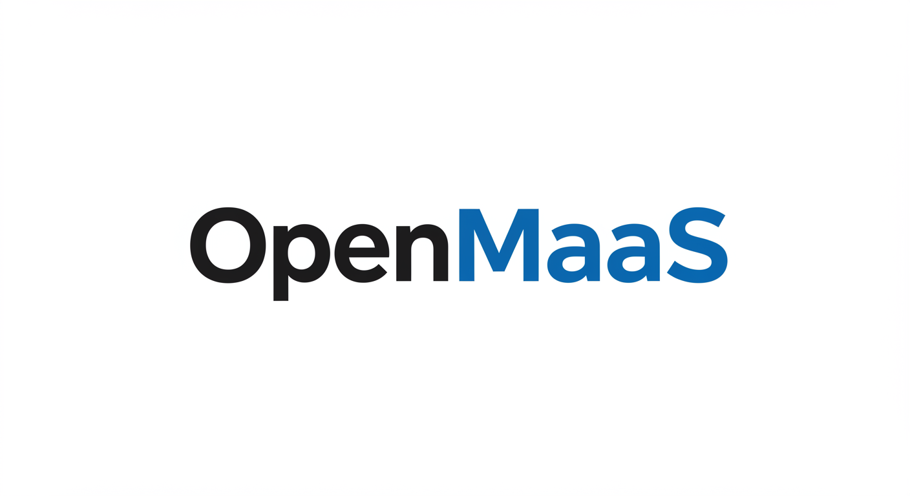

<!-- OpenMaaS Header -->
<div align="center">
  
  
  **🌍 Next-Generation Open Source Mobility as a Service Platform**
  
  *Transforming urban mobility through intelligent transportation integration*
  
  [](https://github.com/ukyonagata0105/OpenMaaS/actions)
  [](https://opensource.org/licenses/MIT)
  [](https://www.typescriptlang.org/)
  [](https://nextjs.org/)
  [](https://nodejs.org/)
  [](https://docker.com/)
  
  <br><br>
  
  <!-- Action Buttons -->
  <a href="#quick-start">
    
  </a>
  <a href="https://openmaas-demo.vercel.app">
    
  </a>
  <a href="#contributing">
    
  </a>
  
  <br><br>
  
  <!-- Social & Community Buttons -->
  <a href="https://github.com/ukyonagata0105/OpenMaaS/stargazers">
    
  </a>
  <a href="https://github.com/ukyonagata0105/OpenMaaS/network/members">
    
  </a>
  <a href="https://twitter.com/intent/tweet?text=Check%20out%20OpenMaaS%20-%20Open%20Source%20Mobility%20as%20a%20Service%20Platform&url=https://github.com/ukyonagata0105/OpenMaaS">
    
  </a>
  
  <br><br>
  
  <!-- Status Badges -->
  [](https://github.com/ukyonagata0105/OpenMaaS/releases)
  [](https://github.com/ukyonagata0105/OpenMaaS/graphs/contributors)
  [](https://github.com/ukyonagata0105/OpenMaaS/issues)
  [](https://github.com/ukyonagata0105/OpenMaaS/commits/main)
  [](https://github.com/ukyonagata0105/OpenMaaS)
  
  <!-- Feature Highlight -->
  <br><br>
  
  
  
  
  
  
</div>

---

## 🌍 Language / 言語選択

[🇺🇸 English](#english) | [🇯🇵 日本語](#japanese)

---

<a name="english"></a>
## 🇺🇸 English

> **🎯 Transform urban mobility with the power of open source**

OpenMaaS is a cutting-edge, open-source Mobility as a Service (MaaS) platform that seamlessly integrates various transportation services—public transit, ride-sharing, micro-mobility, and more—into a unified, intelligent ecosystem. Built with modern web technologies and designed for scale, OpenMaaS empowers cities, transportation providers, and developers to create the future of urban mobility.

**✨ Built by [MaaS Creative Co. Ltd](https://maas-creative.com) with ❤️ for the open source community**

## ✨ Key Features

<table>
<tr>
<td width="50%">

### 🗺️ **Smart Mobility Hub**
- **Multi-modal Integration** - Unify buses, trains, bikes, scooters & ride-shares
- **Interactive Maps** - Real-time transit visualization with live status
- **Intelligent Routing** - AI-powered journey planning across all modes
- **Live Updates** - GTFS/GTFS-RT integration for accurate schedules

</td>
<td width="50%">

### 🔒 **Enterprise Security**
- **Dynamic QR Ticketing** - Self-refreshing codes with watermarks
- **Screenshot Protection** - Advanced anti-fraud detection
- **Role-based Access** - Granular permissions for operators
- **Secure Payments** - Stripe integration with fraud protection

</td>
</tr>
<tr>
<td width="50%">

### 📱 **Modern Experience**
- **Progressive Web App** - Native-like mobile experience
- **Offline Support** - Works without internet connection
- **Real-time Sync** - Instant updates across all devices
- **Responsive Design** - Optimized for any screen size

</td>
<td width="50%">

### 🏗️ **Developer First**
- **Microservices Architecture** - Scalable, containerized design
- **RESTful APIs** - Comprehensive OpenAPI documentation
- **TypeScript** - End-to-end type safety
- **Docker Ready** - One-command deployment

</td>
</tr>
</table>

### 🎯 **Who is OpenMaaS for?**

<table>
<tr>
<td align="center" width="25%">
  
  <h4>🏙️ Cities & Municipalities</h4>
  <p>Integrate all transportation services into one platform for citizens</p>
</td>
<td align="center" width="25%">
  
  <h4>🚌 Transport Operators</h4>
  <p>Manage fleets, monitor performance, and optimize operations</p>
</td>
<td align="center" width="25%">
  
  <h4>👩‍💻 Developers</h4>
  <p>Build on robust APIs and contribute to open source mobility</p>
</td>
<td align="center" width="25%">
  
  <h4>🧳 Travelers</h4>
  <p>Seamless, unified experience across all transportation modes</p>
</td>
</tr>
</table>

### 🏗️ Architecture

OpenMaaS follows a microservices architecture with the following components:

```
┌─────────────────┐    ┌─────────────────┐    ┌─────────────────┐
│   Web Frontend  │    │  Mobile Apps    │    │  Third-party    │
│                 │    │                 │    │  Integrations   │
└─────────┬───────┘    └─────────┬───────┘    └─────────┬───────┘
          │                      │                      │
          └──────────────────────┼──────────────────────┘
                                 │
                    ┌─────────────▼──────────────┐
                    │       Kong API Gateway     │
                    │   (Authentication, Routing) │
                    └─────────────┬──────────────┘
                                 │
        ┌────────────────────────┼────────────────────────┐
        │                       │                        │
┌───────▼────────┐    ┌─────────▼────────┐    ┌─────────▼────────┐
│  Auth Service  │    │  User Service    │    │ Transit Service  │
│ (Port 3001)    │    │  (Port 3002)     │    │  (Port 3003)     │
└────────────────┘    └──────────────────┘    └──────────────────┘
        │                       │                        │
┌───────▼────────┐    ┌─────────▼────────┐    ┌─────────▼────────┐
│ Route Service  │    │ Booking Service  │    │ Payment Service  │
│ (Port 3004)    │    │  (Port 3005)     │    │  (Port 3006)     │
└────────────────┘    └──────────────────┘    └──────────────────┘
        │                       │                        │
        └───────────────────────┼────────────────────────┘
                               │
                    ┌──────────▼───────────┐
                    │     PostgreSQL       │
                    │   (with PostGIS)     │
                    └──────────────────────┘
```

### Services

- **Auth Service**: JWT authentication, Keycloak integration, role-based access control
- **User Service**: User profiles, preferences, trip history management
- **Transit Service**: GTFS data processing, real-time transit information
- **Route Service**: Multi-modal route planning with OpenTripPlanner
- **Booking Service**: Reservation management and provider integration
- **Payment Service**: Stripe payment processing, refunds, payment methods

### 🛠️ Technology Stack

- **Frontend**: Next.js 15.3.3, React 19, TypeScript, Tailwind CSS 4
- **UI Components**: shadcn/ui, Radix UI primitives
- **Backend**: Node.js, NestJS, TypeScript
- **Database**: PostgreSQL with PostGIS for geospatial data
- **Authentication**: Keycloak, JWT, Role-based access control
- **API Gateway**: Kong with rate limiting and service discovery
- **Payment**: Stripe with webhook integration
- **Maps**: Interactive demo maps (Mapbox/Google Maps ready)
- **QR Security**: Dynamic generation with security features
- **Route Planning**: OpenTripPlanner integration
- **Containerization**: Docker, Docker Compose
- **Orchestration**: Kubernetes
- **Cache**: Redis
- **Documentation**: Swagger/OpenAPI

### 📋 Prerequisites

- Node.js 18+ and npm 9+
- Docker and Docker Compose
- Git

### 🚀 Quick Start

1. **Clone the repository**
   ```bash
   git clone https://github.com/ukyonagata0105/OpenMaaS.git
   cd OpenMaaS
   ```

2. **Environment Setup**
   ```bash
   # Copy environment templates
   find . -name ".env.example" -exec cp {} {}.env \;
   
   # Edit environment variables as needed
   # Each service directory contains its own .env file
   ```

3. **Development Setup**
   ```bash
   # Run the automated setup script
   ./scripts/dev-setup.sh
   
   # Or manually start infrastructure
   npm run docker:up
   
   # Start all services in development mode
   npm run dev
   ```

4. **Verify Installation**
   - **Frontend Application**: http://localhost:3000
   - **API Gateway**: http://localhost:8000
   - **Keycloak Admin**: http://localhost:8080 (admin/admin)
   - **Individual service docs**: http://localhost:[port]/api
   
   **🎭 Demo Users** (available on frontend homepage):
   - 👤 **General User**: `user@example.com`
   - 🚌 **Transport Operator**: `operator@jr.example.com`
   - 🎫 **Ticket Provider**: `provider@jtb.example.com`
   - 👑 **System Admin**: `admin@openmaas.example.com`

---

## 🎥 **Demo & Screenshots**

<div align="center">

### 📱 **Mobile Experience**


### 🗺️ **Interactive Maps**


### 🔒 **Secure QR Tickets**


### 📊 **Admin Dashboards**


</div>

---

## 🏆 **Why Choose OpenMaaS?**

<table>
<tr>
<td align="center" width="33%">
  <h3>🚀 **Performance First**</h3>
  <p>Built with Next.js 15 and modern optimization techniques for lightning-fast user experiences</p>
</td>
<td align="center" width="33%">
  <h3>🔧 **Production Ready**</h3>
  <p>Enterprise-grade security, scalability, and reliability for real-world deployments</p>
</td>
<td align="center" width="33%">
  <h3>🌍 **Open Source**</h3>
  <p>Transparent, community-driven development with no vendor lock-in</p>
</td>
</tr>
</table>

### 📖 Documentation

- **API Documentation**: Available at each service endpoint `/api`
- **Architecture Guide**: See `/docs` directory
- **Development Guide**: See [CONTRIBUTING.md](CONTRIBUTING.md)

### 🤝 Contributing

We welcome contributions from developers worldwide! Please see our [Contributing Guide](CONTRIBUTING.md) for details on:

- Code of conduct
- Development workflow
- Pull request process
- Coding standards
- Testing requirements

### 📄 License

This project is licensed under the MIT License - see the [LICENSE](LICENSE) file for details.

### 🛡️ Security

For security vulnerabilities, please see our [Security Policy](SECURITY.md).

### 🌍 Community & Support

- **Website**: [https://maas-creative.com](https://maas-creative.com)
- **Issues**: [GitHub Issues](https://github.com/ukyonagata0105/OpenMaaS/issues)
- **Discussions**: [GitHub Discussions](https://github.com/ukyonagata0105/OpenMaaS/discussions)

### 📈 Roadmap

#### 🎯 **Completed Features**
- [x] **Core MaaS Platform** - Multi-modal transportation integration
- [x] **Interactive Maps** - Real-time transit visualization 
- [x] **Secure QR Ticketing** - Dynamic QR codes with security features
- [x] **Role-Based Dashboards** - Operator and provider management interfaces
- [x] **Progressive Web App** - Mobile-optimized frontend

#### 🚧 **In Development**
- [ ] **Production Map Integration** - Mapbox/Google Maps API integration
- [ ] **Multi-language Support** - Internationalization (i18n)
- [ ] **Smartphone Web App** - Enhanced mobile-first experience with native-like features

#### 🔮 **Future Plans**
- [ ] **Machine Learning** - Route optimization and demand prediction
- [ ] **Native Mobile Apps** - iOS/Android app development kit
- [ ] **Advanced Analytics** - Business intelligence dashboard
- [ ] **Carbon Footprint** - Environmental impact tracking
- [ ] **IoT Integration** - Smart city sensors and real-time data
- [ ] **Voice Assistant** - Alexa/Google Assistant integration
- [ ] **AR Navigation** - Augmented reality wayfinding
- [ ] **Blockchain Ticketing** - Decentralized ticket validation
- [ ] **Third-party Integrations** - More transportation provider APIs

---

<a name="japanese"></a>
## 日本語

### 概要

OpenMaaSは、公共交通機関、ライドシェア、バイクシェアなどの様々な交通サービスを統一プラットフォームに統合するオープンソースのMobility as a Service（MaaS）プラットフォームです。オープンソースコラボレーションを通じて、都市のモビリティをより利用しやすく、効率的で持続可能なものにすることを使命としています。

**開発元: [MaaS Creative Co. Ltd](https://maas-creative.com)**

### 🚀 機能

- **マルチモーダル交通統合**: 公共交通機関、ライドシェア、バイクシェア、徒歩ルートをシームレスに組み合わせ
- **インタラクティブマップ**: リアルタイム交通状況マップとルート可視化、駅情報表示
- **セキュアQRコードチケット**: 30秒更新、スクリーンショット検知、ウォーターマーク付き動的QRコード
- **権限別ダッシュボード**: 交通事業者、チケット提供者、システム管理者向け専用インターフェース
- **リアルタイム交通データ**: GTFS および GTFS-RT サポートによる正確で最新の交通情報
- **スマートルート計画**: 視覚的ルート表示付きマルチモーダル移動計画
- **安全な決済処理**: Stripeサポートと返金管理を備えた統合決済システム
- **ユーザー管理**: 包括的なユーザープロファイル、設定、移動履歴
- **予約システム**: 様々な交通事業者向けの統一予約インターフェース
- **プログレッシブWebアプリ**: オフラインサポート付きモバイル最適化体験
- **開発者フレンドリーAPI**: 包括的なドキュメント付きRESTful API
- **マイクロサービスアーキテクチャ**: Kubernetesサポート付きスケーラブルなコンテナ化サービス

### 🛠️ 技術スタック

- **フロントエンド**: Next.js 15.3.3, React 19, TypeScript, Tailwind CSS 4
- **UIコンポーネント**: shadcn/ui, Radix UI プリミティブ
- **バックエンド**: Node.js, NestJS, TypeScript
- **データベース**: 地理空間データ用PostgreSQL with PostGIS
- **認証**: Keycloak, JWT, ロールベースアクセス制御
- **APIゲートウェイ**: レート制限とサービス発見機能付きKong
- **決済**: Webhookインテグレーション付きStripe
- **マップ**: インタラクティブデモマップ（Mapbox/Google Maps対応準備済み）
- **QRセキュリティ**: セキュリティ機能付き動的生成
- **ルート計画**: OpenTripPlanner統合
- **コンテナ化**: Docker, Docker Compose
- **オーケストレーション**: Kubernetes
- **キャッシュ**: Redis
- **ドキュメント**: Swagger/OpenAPI

### 📋 前提条件

- Node.js 18+ および npm 9+
- Docker および Docker Compose
- Git

### 🚀 クイックスタート

1. **リポジトリのクローン**
   ```bash
   git clone https://github.com/ukyonagata0105/OpenMaaS.git
   cd OpenMaaS
   ```

2. **環境設定**
   ```bash
   # 環境変数テンプレートをコピー
   find . -name ".env.example" -exec cp {} {}.env \;
   
   # 必要に応じて環境変数を編集
   # 各サービスディレクトリには独自の.envファイルがあります
   ```

3. **開発環境セットアップ**
   ```bash
   # 自動セットアップスクリプトを実行
   ./scripts/dev-setup.sh
   
   # または手動でインフラストラクチャを開始
   npm run docker:up
   
   # 開発モードですべてのサービスを開始
   npm run dev
   ```

4. **インストール確認**
   - APIゲートウェイ: http://localhost:8000
   - Keycloak管理画面: http://localhost:8080 (admin/admin)
   - 各サービスのドキュメント: http://localhost:[port]/api

### 🤝 貢献

世界中の開発者からの貢献を歓迎します！詳細については[貢献ガイド](CONTRIBUTING.md)をご覧ください：

- 行動規範
- 開発ワークフロー
- プルリクエストプロセス
- コーディング標準
- テスト要件

### 📄 ライセンス

このプロジェクトはMITライセンスの下でライセンスされています - 詳細は[LICENSE](LICENSE)ファイルをご覧ください。

### 🛡️ セキュリティ

セキュリティの脆弱性については、[セキュリティポリシー](SECURITY.md)をご覧ください。

### 🌍 コミュニティ & サポート

- **ウェブサイト**: [https://maas-creative.com](https://maas-creative.com)
- **課題**: [GitHub Issues](https://github.com/ukyonagata0105/OpenMaaS/issues)
- **ディスカッション**: [GitHub Discussions](https://github.com/ukyonagata0105/OpenMaaS/discussions)

### 📈 ロードマップ

#### 🎯 **完了済み機能**
- [x] **コアMaaSプラットフォーム** - マルチモーダル交通統合
- [x] **インタラクティブマップ** - リアルタイム交通可視化
- [x] **セキュアQRチケット** - セキュリティ機能付き動的QRコード
- [x] **権限別ダッシュボード** - 事業者・提供者管理インターフェース
- [x] **プログレッシブWebアプリ** - モバイル最適化フロントエンド

#### 🚧 **開発中**
- [ ] **本格地図統合** - Mapbox/Google Maps API統合
- [ ] **多言語対応** - 国際化対応（i18n）
- [ ] **スマートフォンWebアプリ** - ネイティブライクなモバイルファースト体験

#### 🔮 **将来計画**
- [ ] **機械学習** - ルート最適化と需要予測
- [ ] **ネイティブモバイルアプリ** - iOS/Android アプリ開発キット
- [ ] **高度な分析** - ビジネスインテリジェンスダッシュボード
- [ ] **カーボンフットプリント** - 環境影響追跡
- [ ] **IoT統合** - スマートシティセンサーとリアルタイムデータ
- [ ] **音声アシスタント** - Alexa/Google Assistant統合
- [ ] **ARナビゲーション** - 拡張現実経路案内
- [ ] **ブロックチェーンチケット** - 分散型チケット検証
- [ ] **サードパーティ統合** - より多くの交通事業者API

---

© 2024 MaaS Creative Co. Ltd. All rights reserved.