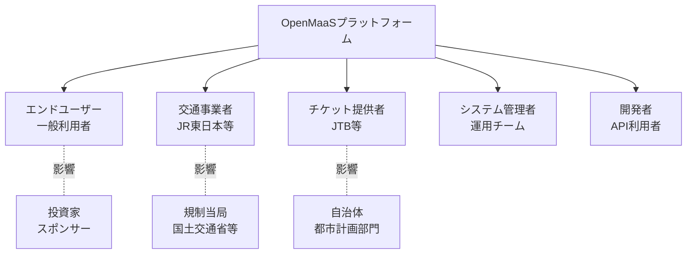

# ステークホルダー要件定義

**プロジェクト**: OpenMaaS - オープンソースMaaSプラットフォーム  
**バージョン**: 1.0  
**更新日**: 2025-11-01  
**ステータス**: 承認済み

---

## 📋 目次

1. [概要](#概要)
2. [ステークホルダーマップ](#ステークホルダーマップ)
3. [エンドユーザー要件](#エンドユーザー要件)
4. [交通事業者要件](#交通事業者要件)
5. [チケット提供者要件](#チケット提供者要件)
6. [システム管理者要件](#システム管理者要件)
7. [開発者・API利用者要件](#開発者api利用者要件)
8. [優先順位マトリクス](#優先順位マトリクス)

---

## 概要

本ドキュメントは、OpenMaaSプラットフォームに関わる全てのステークホルダーの要求事項を明確化し、各ステークホルダーグループのニーズと優先順位を定義します。

### 目的

- 各ステークホルダーの期待値を明確化
- 要件の優先順位付けの根拠を提供
- ステークホルダー間の利害調整の基礎とする
- プロダクトロードマップの策定に活用

---

## ステークホルダーマップ



### ステークホルダー分類

| カテゴリ | ステークホルダー | 影響度 | 関与度 | 優先度 |
|---------|---------------|--------|--------|--------|
| **直接利用者** | エンドユーザー（一般利用者） | 高 | 高 | ⭐⭐⭐ |
| **事業者** | 交通事業者（鉄道・バス会社） | 高 | 高 | ⭐⭐⭐ |
| **事業者** | チケット提供者（旅行会社） | 高 | 高 | ⭐⭐⭐ |
| **運用** | システム管理者 | 高 | 高 | ⭐⭐⭐ |
| **開発** | 開発者・API利用者 | 中 | 高 | ⭐⭐ |
| **間接** | 投資家・スポンサー | 中 | 中 | ⭐⭐ |
| **間接** | 規制当局 | 中 | 低 | ⭐ |
| **間接** | 自治体 | 中 | 低 | ⭐ |

---

## エンドユーザー要件

### ペルソナ: 一般利用者

**プロファイル:**
- **名前**: 田中 花子（仮名）
- **年齢**: 28歳
- **職業**: 会社員（IT企業）
- **居住地**: 東京都渋谷区
- **利用頻度**: 週5日（通勤）+ 週末（レジャー）
- **技術リテラシー**: 高（スマートフォンアプリに慣れている）

### 要求事項

#### 1. 経路検索・予約 ⭐⭐⭐ 必須

| ID | 要件 | 説明 | 優先度 | ステータス |
|----|------|------|--------|-----------|
| EU-01 | マルチモーダル経路検索 | 電車・バス・バイクシェア・徒歩を組み合わせた最適ルートを検索したい | Must | ✅ 実装済み |
| EU-02 | リアルタイム運行情報 | 遅延・運休情報をリアルタイムで知りたい | Must | ✅ 実装済み |
| EU-03 | 複数ルート比較 | 時間・料金・乗換回数で複数ルートを比較したい | Must | ✅ 実装済み |
| EU-04 | ワンクリック予約 | 検索結果から即座に予約・決済を完了したい | Should | 🔄 一部実装 |
| EU-05 | 目的地検索 | 施設名・住所・カテゴリから目的地を検索したい | Should | ✅ 実装済み |

#### 2. チケット管理 ⭐⭐⭐ 必須

| ID | 要件 | 説明 | 優先度 | ステータス |
|----|------|------|--------|-----------|
| EU-06 | デジタルチケット表示 | スマートフォンでチケットを表示・利用したい | Must | ✅ 実装済み |
| EU-07 | QRコード認証 | 改札でQRコードをスキャンして通過したい | Must | ✅ 実装済み |
| EU-08 | チケット履歴管理 | 過去のチケット購入履歴を確認したい | Should | ✅ 実装済み |
| EU-09 | チケットキャンセル | 予定変更時にキャンセル・変更したい | Should | 🔄 一部実装 |
| EU-10 | 定期券・回数券 | お得な定期券や回数券を購入・管理したい | Could | ⏳ 未実装 |

#### 3. ユーザー体験 ⭐⭐ 重要

| ID | 要件 | 説明 | 優先度 | ステータス |
|----|------|------|--------|-----------|
| EU-11 | オフライン対応 | 地下鉄内でもチケットを表示したい | Should | 🔄 一部実装 |
| EU-12 | プッシュ通知 | 出発時刻や遅延情報を通知してほしい | Should | ⏳ 未実装 |
| EU-13 | お気に入りルート | よく使うルートを保存・呼び出したい | Could | ⏳ 未実装 |
| EU-14 | カーボンフットプリント | 移動の環境負荷を可視化してほしい | Could | ⏳ 未実装 |
| EU-15 | アクセシビリティ | 音声読み上げ・拡大表示に対応してほしい | Should | 🔄 一部実装 |

#### 4. 決済 ⭐⭐⭐ 必須

| ID | 要件 | 説明 | 優先度 | ステータス |
|----|------|------|--------|-----------|
| EU-16 | 複数決済手段 | クレジットカード・電子マネー・QR決済に対応してほしい | Must | 🔄 一部実装 |
| EU-17 | ワンタッチ決済 | Apple Pay / Google Pay で簡単に決済したい | Should | ⏳ 未実装 |
| EU-18 | 領収書発行 | 経費精算用の領収書を発行してほしい | Should | ⏳ 未実装 |
| EU-19 | ポイント・クーポン | ポイント還元やクーポンを利用したい | Could | ⏳ 未実装 |

### ユーザーストーリー

**ストーリー1: 通勤ルートの検索**
```
As a 会社員
I want to 自宅から会社までの最適ルートを検索する
So that 最短時間・最安料金で通勤できる

Acceptance Criteria:
- 複数の交通手段を組み合わせたルートが表示される
- 所要時間・料金・乗換回数が比較できる
- リアルタイムの運行情報が反映されている
```

**ストーリー2: 休日の観光計画**
```
As a 旅行者
I want to 一日乗車券を購入して観光スポットを巡る
So that お得に効率的に観光できる

Acceptance Criteria:
- 観光パッケージが検索できる
- チケットがスマートフォンに保存される
- 各施設でQRコードで入場できる
```

---

## 交通事業者要件

### ペルソナ: 交通事業者（鉄道会社）

**プロファイル:**
- **組織**: JR東日本（仮名）
- **部門**: デジタル事業推進部
- **担当者**: 山田 太郎（部長）
- **規模**: 従業員5万人、路線網1,000km以上
- **目的**: デジタル化による運用効率化と顧客満足度向上

### 要求事項

#### 1. 運行管理 ⭐⭐⭐ 必須

| ID | 要件 | 説明 | 優先度 | ステータス |
|----|------|------|--------|-----------|
| TO-01 | リアルタイム運行状況管理 | 全路線の運行状況を一元管理したい | Must | ✅ 実装済み |
| TO-02 | 遅延・運休情報配信 | 遅延や運休情報を即座に利用者に通知したい | Must | ✅ 実装済み |
| TO-03 | 車両位置追跡 | 各車両の現在位置をリアルタイムで把握したい | Should | 🔄 一部実装 |
| TO-04 | ダイヤ管理 | 運行ダイヤを柔軟に変更・管理したい | Must | ⏳ 未実装 |
| TO-05 | インシデント管理 | 事故・故障情報を記録・共有したい | Should | ✅ 実装済み |

#### 2. データ分析 ⭐⭐⭐ 必須

| ID | 要件 | 説明 | 優先度 | ステータス |
|----|------|------|--------|-----------|
| TO-06 | 乗客数分析 | 路線別・時間帯別の乗客数を分析したい | Must | ✅ 実装済み |
| TO-07 | 収益レポート | 日次・月次の収益レポートを自動生成したい | Must | ✅ 実装済み |
| TO-08 | 混雑予測 | AIによる混雑予測で運行計画を最適化したい | Could | ⏳ 未実装 |
| TO-09 | 需要予測 | 季節・イベントに応じた需要予測をしたい | Could | ⏳ 未実装 |
| TO-10 | パフォーマンスKPI | 定時運行率・稼働率などのKPIをダッシュボード表示したい | Should | ✅ 実装済み |

#### 3. システム連携 ⭐⭐ 重要

| ID | 要件 | 説明 | 優先度 | ステータス |
|----|------|------|--------|-----------|
| TO-11 | 既存システム連携 | 既存の運行管理システムと連携したい | Must | 🔄 一部実装 |
| TO-12 | GTFSデータ提供 | GTFS形式でデータを提供・更新したい | Must | ✅ 実装済み |
| TO-13 | GTFS-RT配信 | リアルタイム運行情報をGTFS-RTで配信したい | Should | 🔄 一部実装 |
| TO-14 | API連携 | 他社MaaSプラットフォームとAPI連携したい | Should | 🔄 一部実装 |

#### 4. セキュリティ・コンプライアンス ⭐⭐⭐ 必須

| ID | 要件 | 説明 | 優先度 | ステータス |
|----|------|------|--------|-----------|
| TO-15 | チケット検証 | 不正利用を防ぐための厳格なチケット検証をしたい | Must | ✅ 実装済み |
| TO-16 | データ保護 | 個人情報保護法に準拠したデータ管理をしたい | Must | ✅ 実装済み |
| TO-17 | 監査ログ | 全ての操作ログを記録・監査したい | Must | 🔄 一部実装 |
| TO-18 | アクセス制御 | 部門・役職に応じたアクセス権限を設定したい | Must | ✅ 実装済み |

---

## チケット提供者要件

### ペルソナ: チケット提供者（旅行会社）

**プロファイル:**
- **組織**: JTB（仮名）
- **部門**: デジタルマーケティング部
- **担当者**: 佐藤 美咲（マネージャー）
- **規模**: 従業員2万人、年間取扱額1兆円
- **目的**: 旅行パッケージのデジタル化と販売チャネル拡大

### 要求事項

#### 1. パッケージ管理 ⭐⭐⭐ 必須

| ID | 要件 | 説明 | 優先度 | ステータス |
|----|------|------|--------|-----------|
| TP-01 | パッケージ作成 | 交通+宿泊+観光のパッケージを作成したい | Must | ✅ 実装済み |
| TP-02 | 在庫管理 | パッケージの在庫をリアルタイムで管理したい | Must | ✅ 実装済み |
| TP-03 | 動的価格設定 | 需要に応じて価格を動的に変更したい | Should | ✅ 実装済み |
| TP-04 | シーズン設定 | 繁忙期・閑散期で価格を変更したい | Should | ✅ 実装済み |
| TP-05 | クーポン発行 | プロモーション用のクーポンを発行したい | Should | 🔄 一部実装 |

#### 2. 販売管理 ⭐⭐⭐ 必須

| ID | 要件 | 説明 | 優先度 | ステータス |
|----|------|------|--------|-----------|
| TP-06 | 注文管理 | 注文状況をリアルタイムで追跡したい | Must | ✅ 実装済み |
| TP-07 | 販売レポート | 日次・月次の販売レポートを自動生成したい | Must | ✅ 実装済み |
| TP-08 | 顧客分析 | 顧客の購買行動を分析したい | Should | ✅ 実装済み |
| TP-09 | コンバージョン率分析 | 検索から購入までの導線を最適化したい | Should | ✅ 実装済み |
| TP-10 | キャンセル処理 | キャンセル・返金処理を効率化したい | Must | 🔄 一部実装 |

#### 3. マーケティング ⭐⭐ 重要

| ID | 要件 | 説明 | 優先度 | ステータス |
|----|------|------|--------|-----------|
| TP-11 | レコメンデーション | 顧客の嗜好に合わせたパッケージを推薦したい | Could | ⏳ 未実装 |
| TP-12 | A/Bテスト | 価格・デザインのA/Bテストを実施したい | Could | ⏳ 未実装 |
| TP-13 | 顧客セグメンテーション | 顧客を属性でセグメント化したい | Should | ⏳ 未実装 |
| TP-14 | メールマーケティング | キャンペーン情報をメール配信したい | Should | ⏳ 未実装 |

#### 4. パートナー連携 ⭐⭐ 重要

| ID | 要件 | 説明 | 優先度 | ステータス |
|----|------|------|--------|-----------|
| TP-15 | 交通事業者API連携 | 交通事業者のAPIとシームレスに連携したい | Must | 🔄 一部実装 |
| TP-16 | 宿泊施設連携 | ホテル予約システムと連携したい | Should | ⏳ 未実装 |
| TP-17 | 観光施設連携 | 観光施設の入場券と連携したい | Should | ⏳ 未実装 |
| TP-18 | 決済代行連携 | 複数の決済代行サービスと連携したい | Must | 🔄 一部実装 |

---

## システム管理者要件

### ペルソナ: システム管理者

**プロファイル:**
- **名前**: 鈴木 健（仮名）
- **役職**: SREエンジニア
- **経験**: インフラ運用10年
- **担当**: OpenMaaSプラットフォームの運用・監視
- **目的**: システムの安定稼働と迅速な障害対応

### 要求事項

#### 1. 監視・アラート ⭐⭐⭐ 必須

| ID | 要件 | 説明 | 優先度 | ステータス |
|----|------|------|--------|-----------|
| SA-01 | リアルタイム監視 | CPU・メモリ・ネットワークをリアルタイム監視したい | Must | 🔄 一部実装 |
| SA-02 | アラート通知 | 閾値超過時に即座にアラートを受け取りたい | Must | 🔄 一部実装 |
| SA-03 | ログ集約 | 全サービスのログを一元管理したい | Must | 🔄 一部実装 |
| SA-04 | メトリクスダッシュボード | KPIをダッシュボードで可視化したい | Must | 🔄 一部実装 |
| SA-05 | トレース分析 | 分散トレーシングでボトルネックを特定したい | Should | ⏳ 未実装 |

#### 2. デプロイ・CI/CD ⭐⭐⭐ 必須

| ID | 要件 | 説明 | 優先度 | ステータス |
|----|------|------|--------|-----------|
| SA-06 | 自動デプロイ | GitHubへのプッシュで自動デプロイしたい | Must | ✅ 実装済み |
| SA-07 | ブルーグリーンデプロイ | ダウンタイムなしでデプロイしたい | Should | 🔄 一部実装 |
| SA-08 | ロールバック | 問題発生時に即座にロールバックしたい | Must | 🔄 一部実装 |
| SA-09 | 環境管理 | 開発・ステージング・本番環境を分離管理したい | Must | ✅ 実装済み |

#### 3. セキュリティ ⭐⭐⭐ 必須

| ID | 要件 | 説明 | 優先度 | ステータス |
|----|------|------|--------|-----------|
| SA-10 | 脆弱性スキャン | 定期的な脆弱性スキャンを自動実行したい | Must | 🔄 一部実装 |
| SA-11 | シークレット管理 | API Key・パスワードを安全に管理したい | Must | ✅ 実装済み |
| SA-12 | アクセスログ監査 | 不正アクセスを検知・記録したい | Must | 🔄 一部実装 |
| SA-13 | バックアップ | データベースの自動バックアップを実施したい | Must | 🔄 一部実装 |

#### 4. 運用効率化 ⭐⭐ 重要

| ID | 要件 | 説明 | 優先度 | ステータス |
|----|------|------|--------|-----------|
| SA-14 | オートスケーリング | 負荷に応じて自動でスケールしたい | Should | 🔄 一部実装 |
| SA-15 | コスト最適化 | クラウドコストを可視化・最適化したい | Should | ⏳ 未実装 |
| SA-16 | 障害対応手順書 | インシデント対応手順を自動化したい | Should | ⏳ 未実装 |
| SA-17 | ドキュメント自動生成 | APIドキュメントを自動生成したい | Should | ✅ 実装済み |

---

## 開発者・API利用者要件

### ペルソナ: 外部開発者

**プロファイル:**
- **名前**: 高橋 翔（仮名）
- **職業**: フリーランスエンジニア
- **専門**: モバイルアプリ開発
- **目的**: OpenMaaS APIを使った独自アプリ開発
- **技術**: React Native, TypeScript

### 要求事項

#### 1. API設計 ⭐⭐⭐ 必須

| ID | 要件 | 説明 | 優先度 | ステータス |
|----|------|------|--------|-----------|
| DEV-01 | RESTful API | REST原則に従ったAPIを提供してほしい | Must | ✅ 実装済み |
| DEV-02 | OpenAPI仕様 | OpenAPI（Swagger）仕様書を提供してほしい | Must | ✅ 実装済み |
| DEV-03 | GraphQL対応 | GraphQL APIも提供してほしい | Could | ⏳ 未実装 |
| DEV-04 | Webhook | イベント通知用のWebhookを提供してほしい | Should | 🔄 一部実装 |
| DEV-05 | バージョニング | APIバージョン管理を明確にしてほしい | Must | ✅ 実装済み |

#### 2. ドキュメント ⭐⭐⭐ 必須

| ID | 要件 | 説明 | 優先度 | ステータス |
|----|------|------|--------|-----------|
| DEV-06 | クイックスタートガイド | 5分で動かせるサンプルコードがほしい | Must | ✅ 実装済み |
| DEV-07 | API リファレンス | 全エンドポイントの詳細仕様を知りたい | Must | ✅ 実装済み |
| DEV-08 | ユースケース集 | 典型的な実装例を参考にしたい | Should | 🔄 一部実装 |
| DEV-09 | SDK提供 | JavaScript/Python/Java SDKがほしい | Could | ⏳ 未実装 |
| DEV-10 | 変更履歴 | APIの変更履歴（Changelog）を公開してほしい | Must | ✅ 実装済み |

#### 3. 開発者体験 ⭐⭐ 重要

| ID | 要件 | 説明 | 優先度 | ステータス |
|----|------|------|--------|-----------|
| DEV-11 | サンドボックス環境 | 本番に影響しないテスト環境がほしい | Must | ✅ 実装済み |
| DEV-12 | APIキー管理 | ダッシュボードでAPIキーを管理したい | Must | ✅ 実装済み |
| DEV-13 | 使用量モニタリング | API使用量をリアルタイムで確認したい | Should | 🔄 一部実装 |
| DEV-14 | レート制限 | レート制限の情報を明確に表示してほしい | Must | ✅ 実装済み |
| DEV-15 | サポートフォーラム | 開発者コミュニティでQ&Aしたい | Should | ⏳ 未実装 |

#### 4. データアクセス ⭐⭐ 重要

| ID | 要件 | 説明 | 優先度 | ステータス |
|----|------|------|--------|-----------|
| DEV-16 | リアルタイムデータ | WebSocketでリアルタイムデータを取得したい | Should | 🔄 一部実装 |
| DEV-17 | バルクデータ | 大量データを一括取得したい | Could | ⏳ 未実装 |
| DEV-18 | データフィルタリング | 必要なデータだけを効率的に取得したい | Should | ✅ 実装済み |
| DEV-19 | データフォーマット | JSON/XML/CSVなど複数フォーマットに対応してほしい | Could | 🔄 一部実装 |

---

## 優先順位マトリクス

### 影響度 vs 緊急度マトリクス

```
高影響度 ｜ EU-01,02,03,06,07 ｜ TO-01,02,06,07
        ｜ TP-01,02,06,07   ｜ SA-01,02,06
────────┼──────────────┼───────────────
低影響度 ｜ DEV-03,09,17    ｜ EU-13,14
        ｜ TP-11,12        ｜ SA-15,16
        ｜                 ｜
         低緊急度           高緊急度
```

### 優先順位付けの基準

| 優先度 | 説明 | 対応タイミング | 例 |
|--------|------|---------------|-----|
| **Must Have** ⭐⭐⭐ | プラットフォームの核心機能。これがないとサービスが成立しない | 即時対応 | 経路検索、チケット発行 |
| **Should Have** ⭐⭐ | 重要だが代替手段がある。ユーザー体験を大きく向上させる | 3ヶ月以内 | プッシュ通知、在庫管理 |
| **Could Have** ⭐ | あれば良いが、優先度は低い。将来的な差別化要素 | 6ヶ月以降 | AI推薦、A/Bテスト |
| **Won't Have** | 今回のスコープ外。次期バージョンで検討 | 次バージョン | ブロックチェーン連携 |

---

## ステークホルダー間の調整事項

### 1. データ共有とプライバシー

**課題:**
- 交通事業者は乗客データを保護したい（TO-16）
- チケット提供者は顧客分析のためにデータがほしい（TP-08）

**解決策:**
- 匿名化データのみを共有
- データ利用規約の明確化
- ユーザー同意の取得

### 2. 収益配分モデル

**課題:**
- 交通事業者の既存収益モデルへの影響（TO-07）
- チケット提供者の手数料負担（TP-10）

**解決策:**
- 透明性の高い収益配分ルール策定
- 段階的な移行期間の設定

### 3. システム統合の技術的制約

**課題:**
- 交通事業者の既存システムが古い（TO-11）
- API連携の標準化が必要（DEV-01）

**解決策:**
- アダプターパターンによる柔軟な統合
- GTFSなどの業界標準に準拠

---

## 受け入れ基準

各ステークホルダーグループごとに、以下の基準を満たすことを受け入れ条件とします。

### エンドユーザー
- [ ] 検索から予約まで3タップ以内で完了できる
- [ ] チケット表示まで2秒以内
- [ ] オフラインでもチケット表示可能

### 交通事業者
- [ ] 運行情報の更新が5秒以内に反映
- [ ] 日次レポートが自動生成される
- [ ] 既存システムとの連携が完了

### チケット提供者
- [ ] パッケージ作成から公開まで10分以内
- [ ] 在庫連動がリアルタイムで反映
- [ ] 販売レポートが自動生成される

### システム管理者
- [ ] システムアップタイム 99.9%以上
- [ ] インシデント対応時間 1時間以内
- [ ] ゼロダウンタイムデプロイ実現

### 開発者
- [ ] APIドキュメントが常に最新
- [ ] サンドボックス環境が提供されている
- [ ] サンプルコードが動作する

---

## 変更管理

| バージョン | 日付 | 変更内容 | 承認者 |
|-----------|------|---------|--------|
| 1.0 | 2025-11-01 | 初版作成 | プロジェクトマネージャー |

---

## 参照ドキュメント

- [01-business-requirements.md](./01-business-requirements.md) - ビジネス要件
- [03-system-requirements.md](./03-system-requirements.md) - システム要件
- [04-functional-requirements.md](./04-functional-requirements.md) - 機能要件
- [09-traceability-matrix.md](./09-traceability-matrix.md) - トレーサビリティマトリクス

---

© 2025 MaaS Creative Co. Ltd. All rights reserved.
